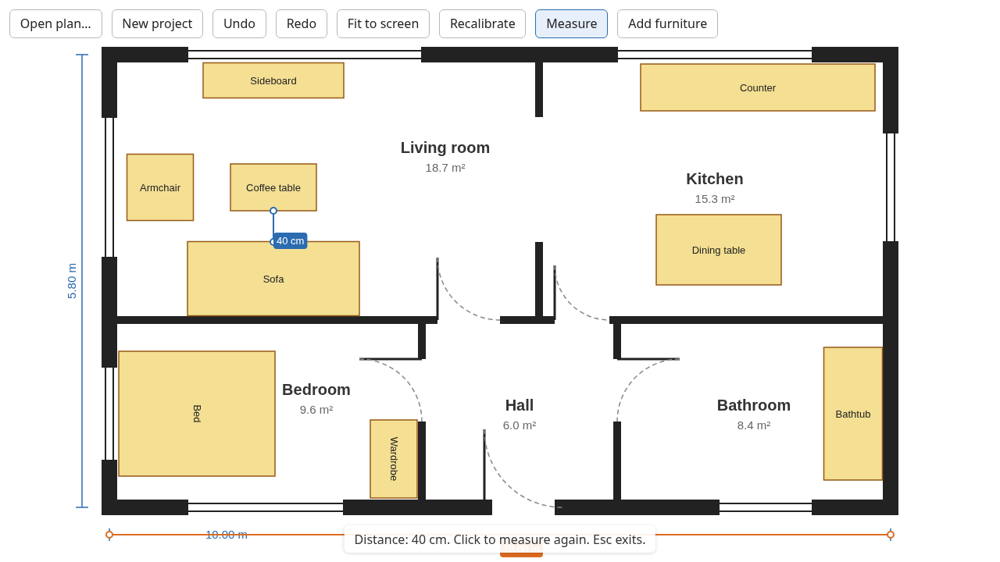

# flat-sim

Plan where your furniture goes before you move it. Open a floor plan, set its scale from one wall you know the length of, then place, move and rotate furniture at its real size.

**Try it:** https://onkelwolle.github.io/flat-sim/



## Features

- Open a floor plan image (drop it on the page or pick a file)
- Calibrate the scale by drawing along a wall and entering its real length
- Measure distances with a measuring tape
- Add rectangular furniture with real dimensions; move, rotate, nudge, rename and resize it
- Undo and redo every edit
- Your project is saved automatically and restored when you come back

## Privacy

flat-sim runs entirely in your browser. Your floor plan and project are stored locally (IndexedDB) and are never uploaded anywhere. Clearing your browser's site data deletes them.

## Development

The toolchain (Node, pnpm, gitleaks) is pinned in `mise.toml`.

```sh
mise install
pnpm install
pnpm dev          # http://localhost:5173/flat-sim/
```

Checks, all run in CI:

```sh
pnpm typecheck
pnpm lint
pnpm format:check
pnpm test         # unit tests (Vitest)
pnpm test:e2e     # end-to-end tests (Playwright); run `pnpm exec playwright install chromium` once first
```

Further reading:

- [`CONTEXT.md`](CONTEXT.md): the domain language (Plan, Calibration, Item, …)
- [`docs/adr/`](docs/adr/): architecture decisions
- [`CLAUDE.md`](CLAUDE.md): notes for coding agents

`main` deploys to GitHub Pages on every push. After UI changes, refresh the screenshot above with `pnpm screenshot`.

## License

[MIT](LICENSE)
